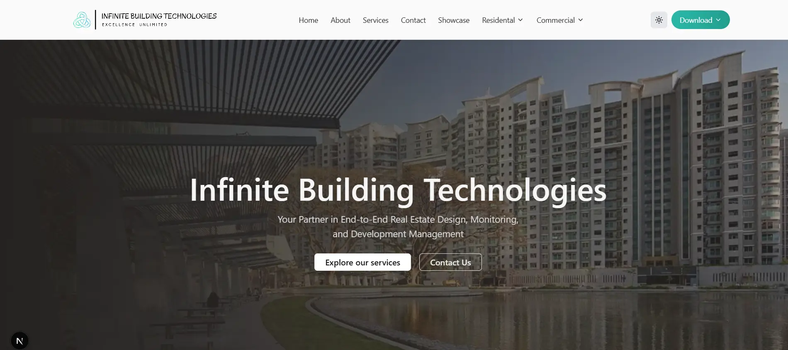

# Infinite Estate Project

A modern, full-stack real estate showcase website built with **Next.js** and **TypeScript**, featuring residential and commercial property portfolios with smooth animations and responsive design.



[View Live Project](https://infinite-estate-project.vercel.app/)

## Features

### Property Categories
- **Residential**: High-rise apartments, mixed-use developments, and plotted villas
- **Commercial**: IT parks, IT-ITES SEZ zones, and retail malls

### Core Functionality
- **Responsive Design**: Mobile-first approach with Tailwind CSS
- **Dark Mode Support**: Toggle between light and dark themes using Next Themes
- **Smooth Animations**: Fluid page transitions and scroll animations powered by Framer Motion
- **WhatsApp Integration**: Floating WhatsApp button for instant customer communication
- **Dynamic Image Gallery**: High-quality project images organized by property type
- **SEO Optimized**: Next.js metadata for better search engine visibility

### Sections
- **Hero Section**: Eye-catching landing with carousel imagery
- **About**: Company information and key highlights
- **Services**: Property solutions and offerings
- **Work/Portfolio**: Featured projects showcase
- **Testimonials**: Client reviews and feedback
- **Contact**: Lead generation and inquiry forms

## Tech Stack

- **Frontend Framework**: Next.js 16.2.3
- **Language**: TypeScript
- **Styling**: Tailwind CSS 4, PostCSS
- **Animations**: Framer Motion (Motion 12.38.0)
- **Theme Management**: Next Themes
- **UI Icons**: React Icons, Lucide React
- **Development**: ESLint, Babel React Compiler

## Getting Started

### Prerequisites
- Node.js 18+ and npm/yarn

### Installation & Development

```bash
# Install dependencies
npm install

# Run development server
npm run dev

# Open browser to
# http://localhost:3000
```

### Production Build

```bash
npm run build
npm start
```

## Project Structure

```
src/
├── app/                    # Next.js app router pages
│   ├── residental/        # Residential property pages
│   └── commercial/        # Commercial property pages
├── sections/              # Landing page sections
├── components/            # Reusable React components
│   ├── layout/           # Header/Footer layouts
│   ├── ui/               # UI building blocks
│   └── animation-components/  # Animation utilities
├── lib/                   # Utility functions
└── types/                 # TypeScript type definitions
```

## Key Components

- **DesktopNavbar/MobileNavbar**: Responsive navigation
- **ShowcaseComponent**: Property display cards
- **SectionAnimation**: Smooth scroll animations
- **FloatingWhatsapp**: Direct messaging widget

